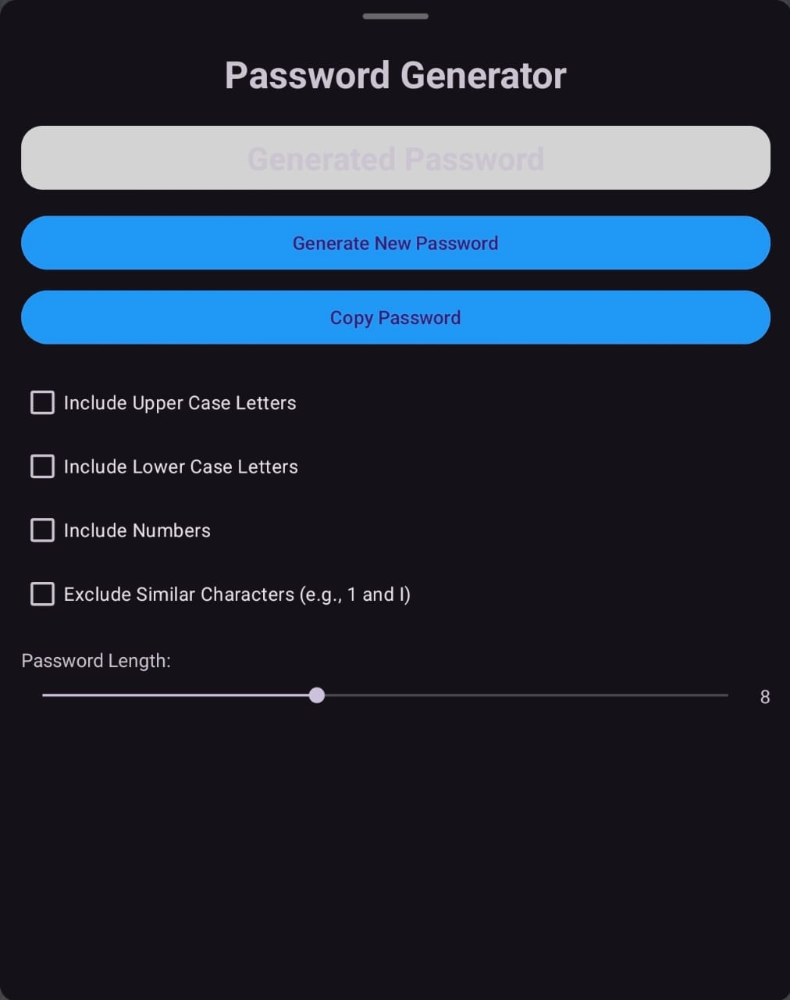

<h1 align="center">Gerador de Senhas</h1>

## Project
This project consists of an Android application that implements a basic password generator. The application allows users to generate random passwords with configurable options such as the inclusion of uppercase letters, lowercase letters, numbers, and the option to exclude similar characters. Users can also set the password length using a seek bar. The generated password is displayed prominently, with buttons to regenerate and copy the password. The interface is clean and intuitive, making it easy to navigate and use.

## Layout
<div align="center">
  
</div>

## Technologies Used
- **Programming Language:** Kotlin
- **Development Environment:** Android Studio

## Code Author
```kotlin
fun main() {
    println("Code by Gabriela Oliveira!")
}
